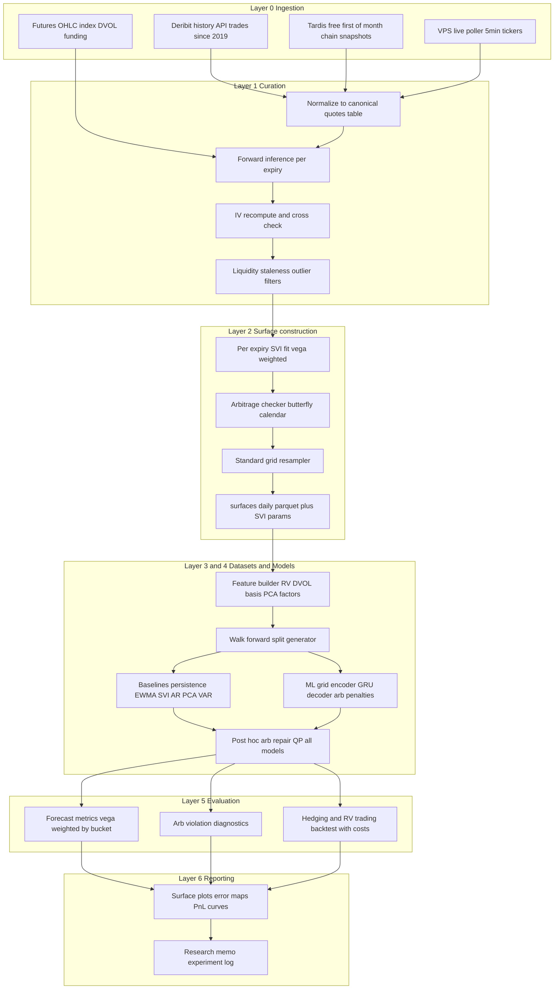
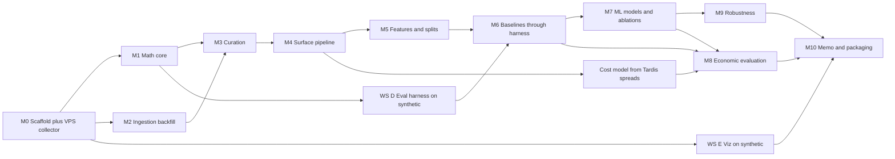

# VolGuard — Arbitrage-Aware IV Surface Forecasting on Deribit BTC Options

Project home: `volguard/` (already bootstrapped with agent config). Hardware confirmed: RTX 4070 8GB + 32GB RAM is ample; one ~$5/mo VPS runs the live collector during dev only.

---

## 1. Plain-English explanation

Options prices imply a "volatility surface": for every strike (how far from the current price) and expiry (how far in the future), the market quotes an implied volatility. This surface moves every day. We will:

1. Rebuild the historical BTC vol surface for every day since ~2021 from Deribit data.
2. Train models to predict tomorrow's surface.
3. Force/encourage predictions to be *arbitrage-free* — a surface that violates butterfly or calendar arbitrage implies impossible prices (e.g., a free lunch from buying a butterfly spread), so a good forecast must respect these shape constraints.
4. Test whether the forecasts are *financially useful* — not just "low RMSE" but "does knowing tomorrow's surface earn money after transaction costs, or hedge a book better?"

The punchline of the memo is the three-way tension: prediction accuracy vs. arbitrage consistency vs. economic value after costs.

## 2. Key finance concepts to learn (in build order)

- **Options basics**: calls/puts, European exercise, payoff diagrams. Deribit specifics: *inverse* contracts (premium quoted in BTC, settlement in BTC, notional 1 BTC), expiries settle 08:00 UTC.
- **Black-76 model**: pricing an option on a *forward* F rather than spot; implied volatility as the number that makes model price = market price.
- **Greeks**: delta (directional exposure), vega (vol exposure), gamma, theta. Vega is our error-weighting workhorse.
- **Forward price and log-moneyness** k = ln(K/F); **total implied variance** w = σ²τ — the natural coordinates where arbitrage conditions are clean.
- **Surface anatomy**: smile, skew (puts richer than calls), term structure.
- **Static no-arbitrage**: butterfly (call price convex in strike ⇔ Durrleman condition on w(k)), calendar (w non-decreasing in τ at fixed k).
- **SVI / SSVI parameterizations** (Gatheral & Jacquier 2014, "Arbitrage-free SVI volatility surfaces") — 5-parameter smile fits with known no-arb conditions.
- **Realized vs implied vol, variance risk premium** (why IV ≠ future RV, why persistence is a strong forecaster).
- **Delta-hedging and vega-neutral spread trades** (straddles, calendars, risk reversals) — the vehicles for economic evaluation.
- **Walk-forward evaluation, transaction costs, slippage** — research hygiene.
- References: Gatheral *The Volatility Surface*; Gatheral–Jacquier 2014; arXiv 2106.07177 (two-step arbitrage-free surface prediction — closest prior work, cited in your PDF); Deribit docs.

## 3. Full architecture



Three-layer story per your PDF: construction → forecasting → financial evaluation. Everything downstream of Layer 2 consumes only the curated surface store, so data and modeling work parallelize cleanly.

## 4. Recommended tech stack (with justifications)

- **Python 3.12 via `uv`** — pin 3.12 (not system 3.13) for maximum wheel compatibility (torch/cvxpy/numba ecosystems); uv gives fast, reproducible, Windows-friendly envs.
- **Polars + DuckDB + Parquet** — columnar, out-of-core, fast on a laptop; DuckDB SQL views over partitioned Parquet beat a database server for a solo research project.
- **NumPy/SciPy** — own ~50-line Black-76 + Brent IV solver + vega (more learning, fewer flaky deps than py_vollib); `scipy.optimize.least_squares` for SVI fits.
- **PyTorch (plain, no Lightning)** — models are <1M params; a 150-line training loop keeps full control over walk-forward refits and custom penalties. Lightning adds abstraction without payoff at this scale.
- **cvxpy + OSQP** — the post-hoc arbitrage-repair projection is a small convex QP; this is the standard tool.
- **pydantic + YAML configs; typer CLI** — every pipeline stage is a CLI command with a config file; no Hydra (overkill, Windows-quirky).
- **Experiment tracking: structured run folders + DuckDB registry** — each run writes `experiments/runs/<id>/` (config.yaml, metrics.json, checkpoints, plots); a DuckDB table indexes them. Zero-ops, fully reproducible, greppable. (W&B optional later.)
- **pytest + hypothesis + pandera** — property tests for the math core; schema contracts between pipeline stages.
- **matplotlib + plotly** — static figures for the memo, interactive 3D surfaces for exploration.
- **ruff + basic pyright; GitHub Actions CI** on small fixture data.
- **Collector**: asyncio + aiohttp poller on a **Hetzner CX22 (~€4/mo) or any $5 VPS**, systemd service, daily upload to **Backblaze B2 / Cloudflare R2 free tier** (data volume ~50MB/day compressed — trivial), pulled to laptop for analysis. Decommission after project ends.

## 5. Data acquisition plan (free path, three sources)

1. **Deribit history REST API (free, no key)** — `history.deribit.com/api/v2/public/get_last_trades_by_currency_and_time`, `kind=option`, paginated by timestamp: **every BTC options trade since platform start**, each record includes traded price (BTC), **`iv` of the trade**, `index_price`, instrument name (encodes expiry/strike/type). Pull 2021-01 → present (~3-5 GB Parquet). Throttled async puller (~5 req/s, backoff, resumable checkpoints). Same API for futures trades; `get_tradingview_chart_data` for futures/perp OHLC; `get_volatility_index_data` for DVOL history; delivery prices endpoint for settlements.
2. **Tardis.dev free samples (no key)** — `datasets.tardis.dev/v1/deribit/options_chain/YYYY/MM/01/OPTIONS.csv.gz`: full tick-level chain (bid/ask/mark IV, greeks, OI) for the **first day of every month since 2019-04** (~85 free days). Used for: (a) validating trade-based surfaces against quote-based marks, (b) building the **bid-ask spread model by moneyness/tenor bucket** that powers the transaction-cost simulator.
3. **Live VPS collector (dev period only)** — every 5 min: `get_instruments` + `get_book_summary_by_currency(BTC, option)` (one call for all instruments) + `ticker` for the ~300 most liquid instruments (bid/ask/mark IV, greeks, OI) + futures tickers + DVOL. Gives dense quote-based surfaces for the final weeks and the intraday stretch goal. Deploy in week 1 to maximize accumulation.

Fallback/upgrade: one paid Tardis month (~$450) would backfill dense quotes 4 months; documented but not required.

## 6. Data schema (Parquet, date-partitioned; pandera-enforced)

- `raw/trades_options`: ts, instrument, expiry, strike, cp, price_btc, iv, amount, index_price, trade_id, block_flag, source
- `raw/trades_futures`, `raw/futures_ohlc`, `raw/index_ohlc`, `raw/dvol`, `raw/funding`
- `raw/ticker_snapshots` (collector): ts, instrument, bid/ask price+size, bid_iv, ask_iv, mark_iv, delta/gamma/vega/theta, oi, underlying_price
- `raw/tardis_chain` (free days, same shape)
- `ref/instruments`: instrument, expiry_ts, strike, cp, creation_ts
- `curated/quotes_norm` (canonical obs): snap_ts, expiry, tau, strike, cp, F, k=ln(K/F), iv_obs, iv_source (trade/mark/mid), usd_premium, size, staleness_s, quality_flags
- `curated/surfaces_daily`: snap_date, per-tenor SVI params (a,b,ρ,m,σ) + fit diagnostics (rmse, n_obs, vega_sum), grid tensor w[tenor, moneyness] with per-cell provenance (n_obs, interp_flag), arb metrics pre/post
- `features/daily`: RV_1/5/22d (Parkinson), returns, jump flag, DVOL, futures basis, funding, OI totals, P/C volume ratio, ATM term slope, 25Δ skew proxies, PCA factors (train-window-fit only), calendar vars
- `experiments/runs` registry + `metrics` long table (run_id, fold, metric, bucket, value)

## 7. Surface construction plan

- **Snap time 08:05 UTC daily** (just after settlement; front expiry has rolled — avoids expiry-boundary artifacts). Surface built from trades in [07:05, 08:05] with exponential recency weighting; widen window with staleness discount when sparse.
- **Forward per expiry**: median put-call parity implied F from near-simultaneous C/P trade pairs at same strike; fallback dated-futures price; fallback index × carry from perp basis. Log which method was used.
- **IV**: trust Deribit's per-trade `iv` as primary; recompute from USD premium (price_btc × index) via own Black-76 as cross-check; flag divergences >2 vol pts (expect issues in deep wings — document).
- **Filters**: τ ≥ 2d; delta in [0.02, 0.98]; IV in [1%, 500%]; MAD outlier rejection on w vs. per-expiry neighbors; min-size and block-trade handling.
- **Fit**: per-expiry **raw SVI** minimizing vega-weighted squared IV error; reject/refit with butterfly penalty if the Gatheral g-function goes negative; then enforce **calendar ordering** across expiries (fit in increasing τ, penalize w_j(k) < w_{j-1}(k) on a shared k-grid). Fallback for sparse days: SSVI (global, fewer params).
- **Canonical representation = fitted SVI params per tenor** (continuous surface). Grids are derived views: model I/O grid on standardized moneyness d = k/(σ_atm√τ) ∈ {-2,…,+2} (9 pts) × tenor {7,14,30,60,90,180}d (6 pts); arb checks/penalties evaluated in fixed-k coordinates (mapped via forecast ATM vol) — this coordinate subtlety is a documented design decision.
- **QC dashboard**: daily fit RMSE, coverage heatmap, arb-violation base rate *of the market itself* (nonzero! — interesting memo material), method-fallback counts.

## 8. Feature engineering plan

- **Surface state**: grid w values (the autoregressive core), ATM IV by tenor, skew = iv(d=-1)−iv(d=+1), curvature = wings−ATM, term slope, top-3 PCA factor scores (PCA fit on train window only, frozen per fold).
- **Underlying**: multi-horizon realized vol (Parkinson/GK from OHLC), overnight return, |ret|>3σ jump flag, high-low range.
- **Deribit-native**: DVOL level + 5d change, annualized futures basis, perp funding, aggregate OI, put/call volume ratio, options volume.
- **Calendar**: day-of-week, days-to-next-monthly/quarterly-expiry.
- **IV−RV spread** (variance-risk-premium proxy) per tenor.
- **Leakage rule**: every feature row carries a max-source-timestamp column; an automated test asserts it ≤ snap time.

## 9. Baseline modeling plan (the bar to clear)

- **B0 Persistence**: ŵ_{t+1} = w_t. Vol surfaces are extremely persistent; this is *the* benchmark and hard to beat. All skill scores are relative to B0.
- **B1 Per-cell EWMA / shrinkage to rolling mean** (λ tuned on train).
- **B2 AR(1) on SVI parameters per tenor** (5 params × 6 tenors; clip to valid parameter region → near-arb-free by construction).
- **B3 PCA(3-5 factors on w grid) + VAR(1) on scores**, reconstruct.
- **B4 HAR-style ridge per cell** using RV/DVOL features — cheap, surprisingly strong, standard in vol literature.
- All baselines run through the same repair layer and the same evaluation harness as the ML models — identical treatment, no favoritism.

## 10. Main ML modeling plan

- **Model A (primary): residual grid forecaster.** Input: last L=20 days of (6×9) grids + feature vector. Encoder: small conv/MLP → latent (dim~16). Temporal core: GRU. Decoder: MLP → **Δw grid (residual over persistence)** — predicting the *change* forces the model to compete exactly where persistence is weak. Loss: vega-weighted Huber on Δw + λ_bfly·butterfly penalty + λ_cal·calendar penalty on the decoded surface (the PDF's penalty sketch, refined to fixed-k coordinates). <1M params; minutes per fold on the 4070.
- **Model B (arb-hard ablation): constrained decoder.** Decoder outputs per-tenor SVI parameters in constrained space (softplus/tanh reparameterization into the known-valid region) + calendar via cumulative softplus increments of ATM total variance. Guarantees (near-)arb-free by construction; tests whether hard constraints cost accuracy vs. Model A's soft penalties.
- **Model C (stretch): probabilistic heads** — quantile regression or small conditional VAE → distributional surface forecasts, CRPS-evaluated.
- **Training protocol**: expanding-window walk-forward refits; chronological validation tail for early stopping; 3 seeds; hyperparameter search on the first two folds only (frozen thereafter — no look-ahead).
- **Ablation grid** (the memo's spine): penalties on/off × residual-vs-level target × features on/off × lookback L × latent dim.
- **Universal post-hoc repair layer**: project any predicted grid onto the nearest arb-free surface (convex QP: min ‖ŵ−w‖² s.t. discrete butterfly convexity + calendar monotonicity; cvxpy/OSQP). Every model reported raw AND repaired → cleanly quantifies "accuracy paid for arbitrage consistency."

## 11. No-arbitrage modeling plan

Build the **checker first** (it is used in 4 places): data QC on market surfaces, SVI fit validation, training penalty, forecast evaluation + repair.
- **Butterfly**: call-price convexity in strike per expiry (computed via Black-76 from w — the defensible primary check) + SVI g-function ≥ 0 for fitted smiles. Report count and magnitude (max + integrated violation).
- **Calendar**: w(k, τ_{j+1}) ≥ w(k, τ_j) on fixed-k grids for adjacent tenor pairs.
- Three enforcement tiers compared head-to-head: (1) unconstrained, (2) soft training penalties, (3) hard-constrained decoder — each with/without repair QP. This comparison IS the research contribution.

## 12. Walk-forward evaluation plan

- History ≈ 2021-01 → present (~4.5y daily surfaces). **Expanding window**: initial train 18mo → val = last 2mo of train (early stopping) → test 2mo; step 2mo → ~15+ folds.
- Hyperparams frozen after fold 2; models refit each fold; 3 seeds.
- **Metrics**: vega-weighted RMSE/MAE in IV and in w; per-bucket (tenor × moneyness) error heatmaps; skill vs. B0 = 1 − MSE/MSE_B0; arb-violation rate & magnitude raw/repaired; Diebold-Mariano significance vs. B0; CRPS if probabilistic.
- Report per-fold distributions, split by regime (calm vs. DVOL>p80 stress) — regime dependence of skill is a headline memo figure.

## 13. Hedging / trading evaluation plan

- **T1 Hedging (must-have)**: short 30d ATM straddle book, delta-hedged daily. Compare next-day P&L *explained* (surface-attribution error) using forecast surface vs. persistence surface. Metric: reduction in unexplained P&L variance. Clean, low-machinery, directly answers "are the Greeks from the forecast better."
- **T2 Relative-value trading (should-have)**: signals = predicted cell-level IV changes and predicted skew/term-spread changes. Vehicles: vega-neutral calendars (tenor signal) and risk-reversals (skew signal), top-N signals daily, vega-budgeted sizing.
- **Cost model** (from Tardis free-day spread study): effective spread in IV points by (tenor, |d|) bucket + Deribit fee schedule (taker ~0.0003 BTC/contract capped at 12.5% of premium — verify in implementation). Three regimes: optimistic (half-spread), base (full spread), stressed (2× spread, applied when DVOL elevated).
- Outputs: cost-adjusted Sharpe, turnover, max drawdown, PnL by regime and by signal bucket, exposure stability (net delta/vega/gamma over time), stress replay of 2021-05, 2022-11 (FTX), 2024 ETF episodes.
- **Honest null**: "nothing survives costs" is an acceptable, publishable finding — the memo frames economic value as the hardest test, not a guaranteed win.

## 14. Risk controls (backtest-enforced)

- Greek caps: |net vega|, |net gamma|, per-expiry and per-wing exposure limits.
- No-trade gates: input surface quality below threshold (n_obs, fit RMSE), forecast repair distance above threshold (model "disagrees with arbitrage" too much), stale collector data.
- Turnover cap + DVOL-conditional size throttle (halve above p90).
- Kill-switch: cumulative drawdown breach halts strategy in-sample-forward.
- All gates logged; "trades suppressed by gate X" is a reported diagnostic.

## 15. Repo structure

```
volguard/
  pyproject.toml            # uv-managed, py3.12
  README.md
  configs/                  # data.yaml, surface.yaml, models/*.yaml, eval.yaml, costs.yaml
  src/volguard/
    ingest/                 # deribit_history.py, tardis_free.py, underlying.py
    collector/              # poller.py, deploy/ (systemd unit, rclone, README)
    curate/                 # normalize.py, forwards.py, blackiv.py, filters.py
    surface/                # svi.py, fit.py, grid.py, arbitrage.py, repair.py
    features/               # realized.py, surface_factors.py, market.py
    datasets/               # windows.py, splits.py, leakage.py
    models/                 # baselines.py, grid_forecaster.py, constrained.py, train.py
    backtest/               # costs.py, hedging.py, relative_value.py, risk.py
    evaluation/             # metrics.py, significance.py, aggregate.py
    viz/                    # surfaces.py, error_maps.py, pnl.py
    cli.py                  # typer: ingest / build-surfaces / features / train / evaluate / backtest / report
  tests/                    # unit/ property/ golden/ (Tardis fixture day)
  notebooks/                # 01_data_tour … 06_results
  experiments/              # runs/<id>/ (gitignored artifacts), registry.duckdb
  docs/                     # memo.md, experiment-log.md, decisions.md (ADRs)
  data/                     # gitignored: raw/ curated/ features/
```

## 16. Module-by-module implementation plan (milestones)

- **M0 Scaffold** (day 1): uv project, pyproject, ruff/pyright/pytest, CI, config system, fill in `volguard/AGENTS.md` project context. Deploy collector to VPS same week.
- **M1 Math core**: `curate/blackiv.py` (Black-76, IV solver, greeks), `surface/svi.py`, `surface/arbitrage.py`, `surface/repair.py` — pure functions, property-tested, zero data dependencies. *This is the foundation everything trusts.*
- **M2 Ingestion**: history-API puller (resumable, throttled), Tardis free downloader, underlying/DVOL pullers → `raw/` complete backfill.
- **M3 Curation**: normalize → forwards → IV cross-check → filters → `curated/quotes_norm`; validation notebook vs. Tardis free days.
- **M4 Surfaces**: SVI fitting pipeline + QC dashboard → `curated/surfaces_daily` for full history; golden-day regression test.
- **M5 Features + datasets**: feature builder, walk-forward splitter, leakage tests.
- **M6 Baselines + eval harness**: B0–B4 through full metric suite; first results tables. *Harness before ML.*
- **M7 ML models**: Model A, penalties, ablation runner; Model B constrained decoder; repair-layer comparisons.
- **M8 Economic evaluation**: cost model from Tardis spreads, T1 hedging, T2 RV backtest, risk gates.
- **M9 Ablations + robustness**: seeds, regimes, sensitivity to filters/λ penalties.
- **M10 Packaging**: figures, README, memo, experiment log, repo polish, collector decommission.

## 18. Parallel AI-agent workstreams

(Numbering follows your list, which had no #17.)

- **WS-A Ingestion** (M2): history puller + Tardis + underlying. Contract: `raw/` pandera schemas.
- **WS-B Math core** (M1): Black-76/SVI/arb/repair. Pure, fixture-tested — the ideal isolated agent task.
- **WS-C Collector + VPS** (M0): poller, systemd, B2 sync. Fully independent; ship day 1.
- **WS-D Eval harness + backtester skeleton** (M6 scaffold): builds against synthetic surfaces + B0, so it needs no real data to start.
- **WS-E Viz/reporting**: surface plots, error maps, PnL tearsheets against synthetic inputs.
- **Integration rule**: pandera schemas + `configs/*.yaml` are frozen contracts; agents work against fixtures (one Tardis free day committed as test data) before real data lands. You (human) review at milestone gates M1, M4, M6, M8.

## 19. Task dependency graph



Critical path: M0 → M1 → M3 → M4 → M5 → M6 → M7 → M8 → M10. WS-C/D/E run off-path in parallel.

## 20. Test plan

- **Unit**: Black-76 price↔IV round-trip; put-call parity; vega>0; SVI eval vs. hand-computed values; checker on hand-crafted violating and clean surfaces; repair QP is identity on arb-free input.
- **Property (hypothesis)**: IV solver converges ∀ valid random inputs; repaired surfaces always pass checker; SVI fits on random valid-param synthetic smiles recover params; grid interpolation preserves calendar ordering.
- **Golden**: one committed Tardis free day → full pipeline → surface snapshot compared with tolerances (regression test for the whole stack).
- **Data QC gates**: pandera schemas at every stage boundary; daily coverage assertions.
- **Leakage tests**: max-source-timestamp ≤ snap time; split-overlap assertions; PCA-fit-window assertions.
- **Backtest sanity**: persistence forecast + zero costs ⇒ ≈0 PnL for spread trades; costs strictly reduce PnL; deterministic toy scenario with known outcome.
- **CI**: ruff + pyright + unit/property/golden on fixtures per push.

## 21. Final deliverables

- Reproducible repo (one-command pipeline per stage from raw pulls to memo figures).
- Datasets: raw pulls + curated daily surfaces (~4.5y) + collector archive + build scripts.
- Experiment registry: all runs, configs, seeds, metrics.
- Figure pack: surface evolution animation, forecast-vs-realized slices, error heatmaps by bucket, arb-violation maps, skill-by-regime, PnL tearsheets under 3 cost regimes.
- Research memo (see 23) + experiment log + ADRs (decisions.md).

## 22. README outline

1. What this is (one paragraph + hero surface GIF)
2. Headline results (3 figures: skill vs persistence, arb-violation reduction, cost-adjusted PnL) — including negative results, stated plainly
3. Quickstart (uv sync; make demo runs on committed fixture day)
4. Full reproduction (data pulls → surfaces → train → evaluate → report; expected runtimes)
5. Architecture diagram + repo map
6. Data sources & licenses/ToS notes
7. Methodology summary (links to memo)
8. Limitations & failure modes
9. Collector deployment guide (VPS)
10. Citation / acknowledgments

## 23. Research memo outline (docs/memo.md → PDF)

1. Abstract (task, data, headline numbers)
2. Data: sources, trade-based vs quote-based surface validation study, market's own arb-violation base rate
3. Surface construction methodology + QC
4. Forecasting problem: coordinates, targets, leakage protocol
5. Models: baselines → Model A → Model B; loss design
6. No-arbitrage enforcement: three tiers + repair QP
7. Results I — accuracy: skill vs B0 by bucket/regime, DM tests
8. Results II — arbitrage: violation rates/magnitudes raw vs repaired vs constrained
9. Results III — economic value: hedging variance reduction; RV PnL under 3 cost regimes
10. Ablations (penalty λ, residual target, features, lookback)
11. Failures & limitations (trade-sparsity noise, wing extrapolation, regime fragility, single-venue, ~4.5y sample)
12. Future work (ETH, intraday, deep hedging)
13. Reproducibility appendix + references

## 24. Fallback plan if parts are too hard

- **Trade-based daily surfaces too noisy** → restrict to liquid core (30/60/90d, |d|≤1.5), weekly horizon, or lean on collector quote data (shorter history — stated honestly).
- **SVI fitting unstable** → SSVI global fit (fewer params) or nonparametric smoother + repair QP only.
- **ML never beats persistence** → that IS a publishable finding; memo pivots to "where/when does ML add value" bucket analysis + the arb-repair value story (repair alone improves baselines?).
- **Constrained decoder (Model B) too hard** → ship penalties + repair only; note as future work.
- **T2 trading backtest too heavy** → T1 hedging study only (still a complete economic evaluation).
- **VPS fails/annoys** → Windows Task Scheduler local poller (accept gaps) + Tardis free days.

## 25. Stretch goals if ahead of schedule

- ETH surfaces + cross-asset transfer test (same weights, new asset).
- Intraday (4h) forecasting from collector data.
- Deep-hedging extension (PFHedge-style) using forecast surfaces as state.
- Conditional-VAE generative surface simulator with arb-free sampling.
- Paid-Tardis one-month backfill for dense-quote robustness check.
- arXiv-style writeup; OKX free-day cross-venue sanity check.

---

## Questions I resolved myself (flagging, not blocking)

- **Free data path chosen** (your budget signal): trades-based history + Tardis free days + VPS collector. Paid Tardis documented as optional upgrade.
- **Daily horizon first**, intraday as stretch (daily has 4.5y of history; intraday only has what we collect).
- **VPS over always-on laptop** for the collector: $5/mo buys immunity to sleep/reboots/Windows updates; dev-period only.
- Timeline expectation with heavy AI assistance: **6–9 weeks part-time**, gated by the milestone graph rather than calendar weeks.


### Possible add ons
Live inference service — a small FastAPI endpoint + dashboard that pulls the latest collector snapshot, runs the trained model, and renders today's forecast surface with arb diagnostics. Turns the project from batch research into a deployed ML system (this is the highest-value eng addition for an ML-engineer story).
Productionize the collector — Docker, healthchecks, alerting on gaps, a data-quality monitor. Cheap to do, reads as SRE/platform maturity.
Performance engineering pass — vectorize/numba the SVI fitter and IV solver, benchmark it (e.g., "full 4.5-year surface rebuild in N minutes"), document the speedup. Quant firms care about this a lot.
Model registry + one-command reproduction — already sketched in the plan (experiment registry), but you can lean into it harder with content-hashed configs and a make reproduce-figure-3 style interface.